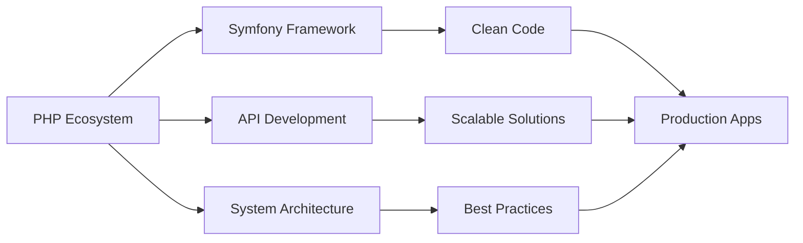

# 👨‍💻 **Mohamed Riadh Mennane**  
### PHP-Centric Developer | Architecture Enthusiast | ISMAGI Rabat  

<div align="center">

```php
<?php

class Developer {
    public string $name = 'Mohamed Riadh Mennane';
    public string $focus = 'PHP Backend Development';
    public string $education = 'ISMAGI Rabat';
    public array $passions = [
        'Clean Architecture',
        'Scalable Systems',
        'Modern Web Solutions'
    ];
}
```
</div>

---

## 🎯 **Core Expertise**

| **Domain** | **Technologies** | **Status** |
|------------|------------------|------------|
| **Backend** | PHP, Symfony, REST APIs | 🚀 **Advanced** |
| **Database** | MySQL, Database Design | 🏗️ **Production Ready** |
| **DevOps** | Git, GitHub, CI/CD Concepts | 📚 **Mastering** |
| **Cloud** | Firebase, Deployment | 🌱 **Growing** |

---

## 📊 **Tech Spectrum**



---

## 🏗️ **Current Projects**

### 🔥 **Active Development**
- **PHP Framework Deep Dive** – Mastering Symfony internals
- **API-First Applications** – Building scalable backend systems
- **Database Optimization** – Performance-focused MySQL design

### 📚 **Learning Path**
```bash
# Current learning stack
$ php artisan learn:symfony
$ git commit -m "Advanced patterns"
$ docker compose up -d # Coming soon!
```

---

## 🛠️ **Toolbox**

<div align="center">

### **Primary Stack**


### **Development**


### **Emerging**


</div>

---

## 📈 **Development Philosophy**

```yaml
development_principles:
  - clean_architecture: true
  - test_driven: "learning"
  - api_first: true
  - documentation: "essential"
  - performance: "priority"
  
current_focus:
  - symfony_components: "in progress"
  - design_patterns: "studying"
  - system_design: "exploring"
```

---

## 🌐 **Connect & Collaborate**

<div align="center">

[](https://mennaneriad.web.app)
[](https://www.linkedin.com/in/mohamed-riad-mennane)
[](mailto:YOUR_EMAIL@HERE)

</div>

---

## 🎨 **GitHub Stats**

<div align="center">


</div>

---

> **"Building the backend of tomorrow, one line at a time."**  
> *More architecture-focused projects coming soon...*

---

<sub>⚡ **P.S.** Always open to discussing PHP architecture, clean code, and innovative backend solutions!</sub>
